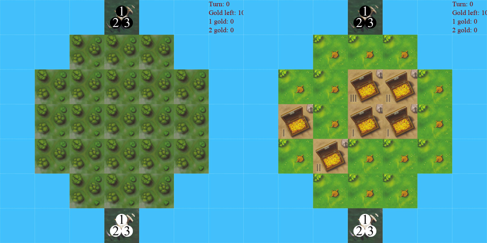
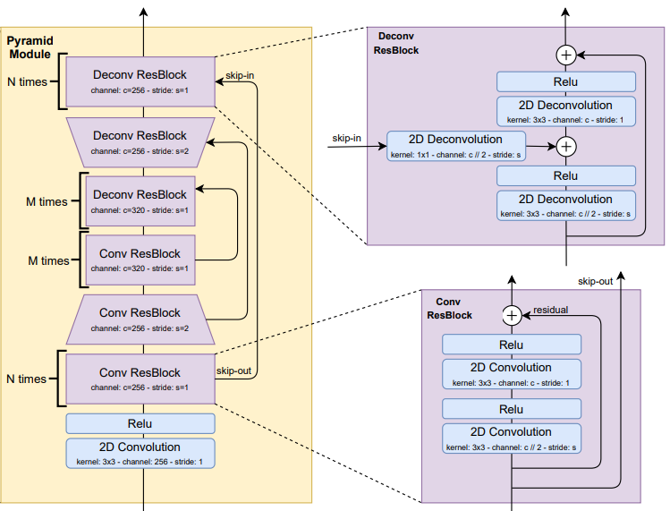

# JackalRL

В данной директории представлена работа над решением упрощенной версии настольной игры Шакал: с уменьшенным полем и ограниченным числом допустимых клеток.

Пример поля упрощенной версии Шакала:

## Результаты
Был реализован DQN алгоритм. В качестве аппроксимации Q-функции использовалась нейросеть с Unet-подобной архитектурой с ResidualBlock в качестве основы:

Алгоритм обучался в режиме self-play, не имея какого либо предварительного знания о структуре среды. Итоговая модель сходится к некой оптимальной стратегии примерно за 1500 игр. Агент успешно собирает все золото на острове и заканчивает игру раньше, чем она искусственно прерывается. Во время дальнейшего обучения агент продолжает совершенствовать стратегию, все быстрее и быстрее достигая необходимого результата и чаще заканчиваю игру с самим собой вничью. Кроме этого, обучение происходит стабильно и устойчиво: награда незначительно варьируется от сессии к сессии, начальная оценка позиции равномерно растет, достигая значений ~2.

Однако, при всех хороших сторонах модели, она не может показать положительный результат против жадной стратегии: агент способен побеждать жадный алгоритм в 20% случаев и играет с ним в ничью в 25% случаев. Из основных проблем можно выделить периодические зацикливания агента (повторения одних и тех же действий по кругу), его частичная неспособность построить долгосрочную стратегию, выражающаяся в частых сменах плана на ходу (например, агент начать идти к одной клетке с золотом, а на полпути изменить свой маршрут), нежелание атаковать противника даже в самых выгодных для этого случаях и чрезмерная «жадность» некоторых действий и стратегий.

## Будущая работа
Ограничения реализованного алгоритма не позволили достичь оптимальной стратегии в игре. DQN алгоритм не обладает достаточно комплексным пониманием динамик переходов и не имеет широкого горизонта планирования. Одним из возможных направлений развития данной работы является адаптация MCTS алгоритмов для данной среды и их комбинация с model-free методами.

## Дополнительные материалы
sample_text
